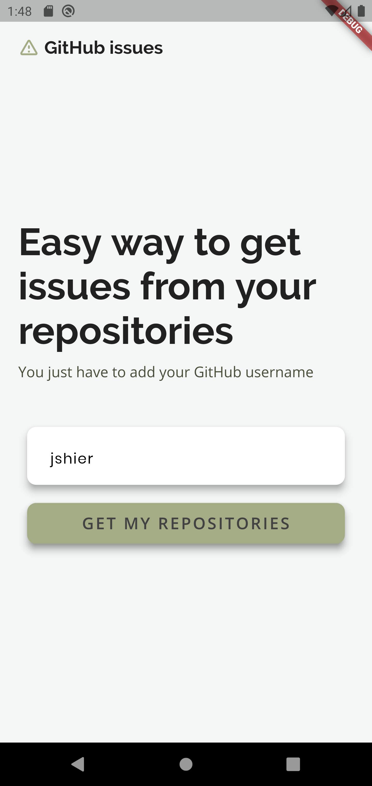
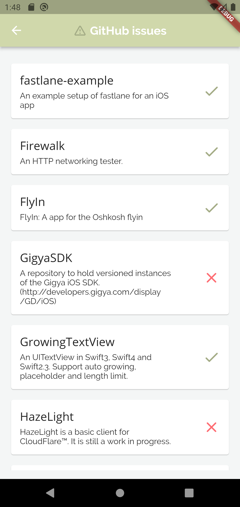
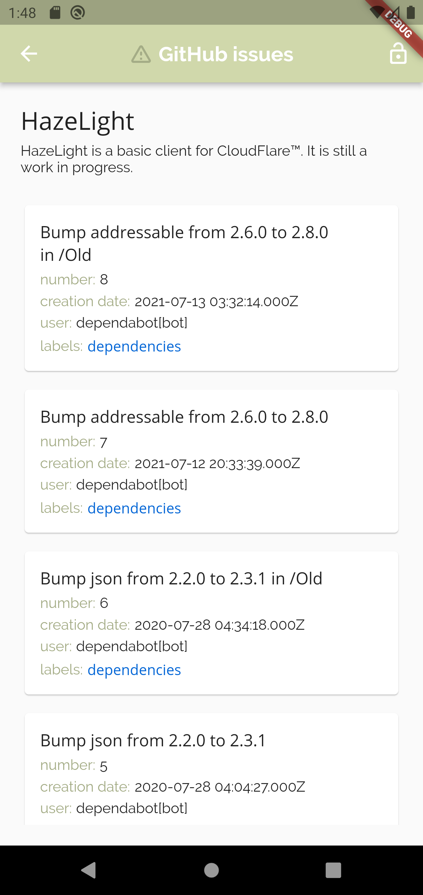

# iOS Developer

## Instructions

- Fork this project.
- Write tests.
- Commit the important milestones and not just the final result.

## Exercise description

Create an iOS app that lists the issues of a GitHub repository using the official [GitHub API]( https://developer.github.com/), you can choose between REST and GraphQL.

### Requirements

- Display the list of issues
	- Open/Closed switch filter on the list
	- Infinity scroll
	- You can use a fixed repository, eg.: https://github.com/Alamofire/Alamofire
- Display the issue information in a new screen

**Each issue item on the list should contain:**

- title
- number
- creation date
- author login
- labels with the correct color

**The issue view should contain:**

- title
- number
- creation date
- author login
- author avatar
- labels with the correct color
- description
	- only the text part is required
	- but fell free to go with markdown rendering, code highlight and images if you like

## Notes

- You will make the UI decisions, no need for anything fancy though, only if you like some extra points ;)
- The app should
	- Not block
	- The content should respect the device orientation and screen sizes
	- Provide good feedback to the user (loading, error, etc)
- You are free to choose any libraries you feel like, but keep the project as simple and organized as possible
- Explaining how to build your project if it's needed

### What we'll evaluate

- Working app
- Tests
- Code organization
- Architecture
- UX

# My solution

I made this task in Flutter and test it only on Android.

The implementation:

On the first screen the user can add a GitHub username. If the username is incorrect, a pop up window will appear.

According to the username there is a list of the user's public repositories. A check mark or an x marks whether or not there are issues.

By clicking to the repository card will appear a list of the current repository's issues appear with some information. By clicking to the lock on the top right corner the user can see only the open issues or the closed issues.

By clicking to the issue card will appear some further information from the issue.
